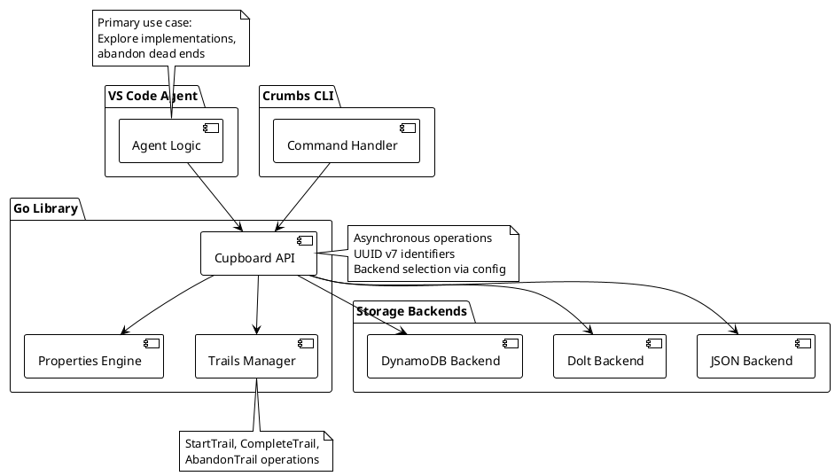

# Crumbs Architecture

## System Overview

Crumbs is a storage system for work items with first-class support for exploratory trails. The core insight is that coding agents need backtracking: an agent drops crumbs as it explores an implementation approach, and if the approach leads nowhere, the agent abandons the entire trail without polluting the permanent task list.

The system provides a Go library (`pkg/cupboard`) for agents and a command-line tool (`crumbs` CLI) for development and personal use. The primary use case is a VS Code coding agent that uses trails to explore implementation approaches. Storage is pluggable—local JSON files for development, Dolt for version control, DynamoDB for cloud scale. All operations are asynchronous. All identifiers use UUID v7 (time-ordered, sortable).



### Lifecycle

Crumbs have a lifecycle driven by state transitions and trail operations.

**Crumb states**: `pending` → `ready` → `running` → `completed` or `failed`. Agents define state semantics. Crumbs storage tracks state but does not enforce transitions—agents or coordination layers handle that.

**Trail states**: `active` → `completed` or `abandoned`. When a trail completes, all crumbs on the trail become permanent (trail_id cleared). When a trail is abandoned, all crumbs on the trail are deleted or excluded from queries—the exploration failed and you backtrack.

**Trail structure**: Trails form a tree. Each trail is a flat collection of crumbs (all tagged with the same trail_id), but trails can branch—a new trail can deviate from a crumb on an existing trail (recorded via parent_crumb_id). Within a trail, crumbs can have dependency relationships (recorded in the dependencies property), forming a directed acyclic graph. The overall structure is a tree of trails, each containing a DAG of crumbs.

### Coordination Pattern

Crumbs provides storage, not coordination. Agents or coordination frameworks build claiming, timeouts, and announcements on top of the Cupboard API. We expose async read/write operations; agents add workflow semantics.

## Main Interface

The Cupboard API is the contract between applications and storage backends. All operations are asynchronous (return futures or use async/await). Operations are grouped by entity: crumbs, trails, properties, metadata.

### Data Structures

| Type | Description | Key fields |
|------|-------------|------------|
| Crumb | Work item | crumb_id (UUID v7), name, state, trail_id, timestamps |
| Trail | Exploration session | trail_id (UUID v7), parent_crumb_id, state, timestamps |
| Property | Property definition | property_id (UUID v7), name, value_type, description |
| Category | Categorical value | category_id (UUID v7), property_id, name, ordinal |
| Metadata | Extensible data | metadata_id (UUID v7), crumb_id, content, timestamps |

Full field specs are in the PRD (prd-task-storage).

### Operations

| Operation | Purpose |
|-----------|---------|
| OpenCupboard(config) | Initialize storage backend |
| CloseCupboard() | Release resources |
| DropCrumb(name, trail_id?) | Create crumb; optionally assign to trail |
| GetCrumb(crumb_id) | Retrieve crumb by ID |
| DeleteCrumb(crumb_id) | Remove crumb and all properties/metadata |
| StartTrail(parent_crumb_id?) | Create trail; optionally deviate from crumb |
| GetTrail(trail_id) | Retrieve trail by ID |
| GetTrailCrumbs(trail_id) | List all crumbs on a trail |
| CompleteTrail(trail_id) | Mark trail completed; clear trail_id from crumbs (merge to permanent) |
| AbandonTrail(trail_id) | Mark trail abandoned; delete or exclude crumbs (backtrack) |
| DefineProperty(name, description, value_type) | Create property definition |
| ListProperties() | List all property definitions |
| DefineCategory(property_id, name, ordinal) | Create category for categorical property |
| SetCrumbProperty(crumb_id, property_id, value) | Set property value for crumb |
| GetCrumbProperty(crumb_id, property_id) | Get property value |
| GetCrumbProperties(crumb_id) | Get all properties for crumb |
| ClearCrumbProperty(crumb_id, property_id) | Remove property value |
| RegisterMetadataTable(table_name, schema) | Add new metadata table type |
| AddMetadata(table_name, crumb_id, content, property_id?) | Add metadata entry |
| GetMetadata(table_name, crumb_id) | Retrieve metadata entries |
| SearchMetadata(table_name, filter) | Search metadata by crumb, property, or text |
| FetchCrumbs(filter) | Query crumbs by properties; exclude abandoned trails by default |

## System Components

**Cupboard API (pkg/cupboard)**: Main interface. Agents and applications call OpenCupboard with config, get a Cupboard instance, and invoke operations. Delegates to backend implementations. Handles UUID v7 generation and timestamp derivation.

**Properties Engine (internal/properties)**: Manages property definitions, categories, and type-specific property storage (categorical, text, integer, list). Enforces property types and validates values. Extensible—new properties defined at runtime without schema changes.

**Trails Manager (internal/trails)**: Implements trail lifecycle. CompleteTrail clears trail_id from all crumbs (they become permanent). AbandonTrail deletes or marks crumbs as abandoned. Ensures queries exclude abandoned trails by default.

**Storage Backends (internal/backends)**: Pluggable implementations. JSON backend writes to local files for development. Dolt backend uses SQL with version control. DynamoDB backend uses NoSQL tables for cloud scale. Each backend implements the full Cupboard interface.

**CLI (cmd/crumbs)**: Command-line tool for development and personal use. Commands map to Cupboard operations (drop, show, trail start, trail complete, trail abandon, fetch). Config file selects backend. Used for testing and as a reference implementation.

## Design Decisions

**Decision 1: UUID v7 for all identifiers**. We chose UUID v7 (time-ordered UUIDs per RFC 9562) because they are sortable by creation time without separate timestamp columns. This simplifies pagination, reduces index size, and works across distributed backends. Alternative: auto-increment IDs are not suitable for distributed systems; UUID v4 lacks time ordering.

**Decision 2: Properties as first-class entities**. Property definitions have their own IDs and table. This enables runtime extensibility—agents define new properties without schema migrations. Type-specific tables (categorical, text, integer, list) enforce value types and enable efficient queries. Alternative: storing properties as JSON blobs is less queryable and loses type safety.

**Decision 3: Trails with complete/abandon semantics**. Trails represent agent exploration sessions. CompleteTrail merges crumbs into the permanent record by clearing trail_id. AbandonTrail removes crumbs entirely (backtracking). This keeps the permanent task list clean and makes agent exploration explicit—try an approach, abandon if it fails, complete if it succeeds. Alternative: marking crumbs as "tentative" is less clear and requires agents to manually track and clean up failed explorations.

**Decision 4: Pluggable backends with full interface**. Each backend implements the entire Cupboard interface. This allows backend-specific optimizations (Dolt version history, DynamoDB single-table design) without leaking details into the API. Alternative: a generic SQL backend with schema generation is less flexible and cannot leverage backend-specific features.

**Decision 5: Asynchronous API**. All operations return futures or use async/await patterns. This supports backends with network calls (DynamoDB) and keeps the CLI responsive. Backends may implement operations synchronously internally if local (JSON files). Alternative: synchronous API is simpler but blocks on I/O and does not scale to remote backends.

## Technology Choices

| Component | Technology | Purpose |
|-----------|------------|---------|
| Language | Go | CLI tool and library; strong concurrency, static typing |
| Identifiers | UUID v7 (RFC 9562) | Time-ordered, sortable, distributed-safe IDs |
| CLI | cobra + viper | Command parsing and config management |
| JSON backend | encoding/json | Local file storage for development |
| Dolt backend | go-mysql-driver + Dolt SQL | Version-controlled relational storage |
| DynamoDB backend | AWS SDK for Go v2 | Serverless NoSQL cloud storage |
| Testing | Go testing + testify | Unit and integration tests |
| Async | Goroutines + channels | Concurrent operations, future-like patterns |

## Project Structure

```
crumbs/
├── cmd/
│   └── crumbs/          # CLI entry point
├── pkg/
│   └── cupboard/        # Public API: Cupboard interface, types
├── internal/
│   ├── properties/      # Properties engine (definitions, categories, values)
│   ├── trails/          # Trails manager (complete, abandon, queries)
│   └── backends/
│       ├── json/        # JSON file backend
│       ├── dolt/        # Dolt SQL backend
│       └── dynamodb/    # DynamoDB backend
├── docs/
│   ├── VISION.md
│   ├── ARCHITECTURE.md
│   └── product-requirements/
│       └── prd-task-storage.md
└── .claude/             # Project rules and commands
```

**pkg/cupboard**: Public API. Agents and applications import this. Defines Cupboard interface, crumb/trail/property types, and OpenCupboard factory function.

**internal/properties**: Property definitions, category management, and type-specific property storage. Not directly importable; used via Cupboard API.

**internal/trails**: Trail lifecycle operations. Manages trail state transitions, crumb membership, and query filtering.

**internal/backends**: Backend implementations. Each backend is a separate package implementing the Cupboard interface.

**cmd/crumbs**: CLI tool. Parses commands, loads config, opens Cupboard, and invokes operations.

## Implementation Status

We are currently in the bootstrap phase. Implementation will proceed in phases:

**Phase 1: Core storage with JSON backend**. Implement Cupboard API, crumb/trail tables, JSON backend, basic CLI commands (drop, show, fetch). Validates core concepts and provides a working system for local use.

**Phase 2: Properties and metadata**. Add properties table, type-specific property storage, metadata tables, RegisterMetadataTable. Enables extensibility without schema changes.

**Phase 3: Trails support**. Implement StartTrail, CompleteTrail, AbandonTrail. Add trail filtering to FetchCrumbs. Validates the exploratory workflow.

**Phase 4: Additional backends**. Add Dolt backend (version control) and DynamoDB backend (cloud scale). Validates pluggable architecture and backend-specific optimizations.

Success criteria (from VISION): operations complete with low latency, agents integrate the library quickly, trail workflows feel natural for coding agents exploring implementation approaches.

## Related Documents

| Document | Purpose |
|----------|---------|
| VISION.md | What we are building and why; success criteria and boundaries |
| prd-task-storage.md | Detailed requirements: schemas, operations, acceptance criteria |

## References

- RFC 9562: UUID v7 specification
- Dolt documentation: SQL with Git semantics
- DynamoDB best practices: Single-table design, GSI patterns
