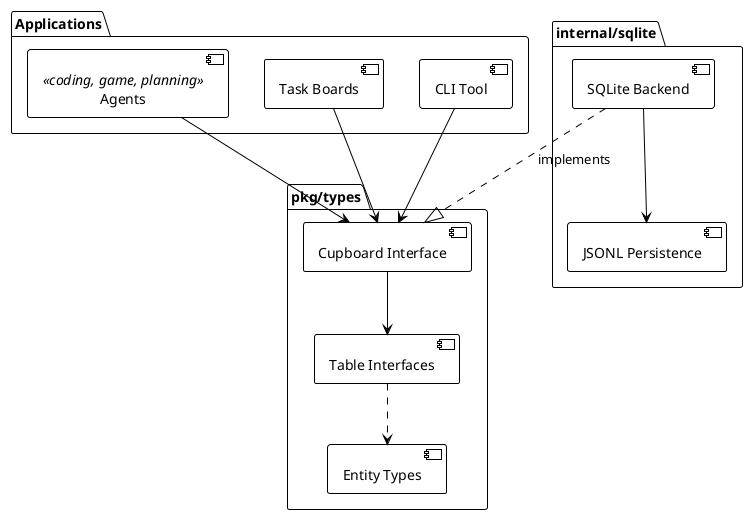
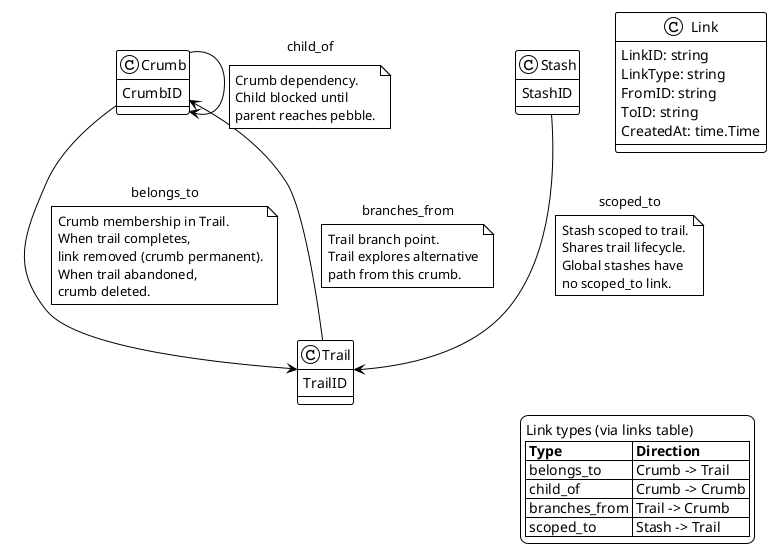
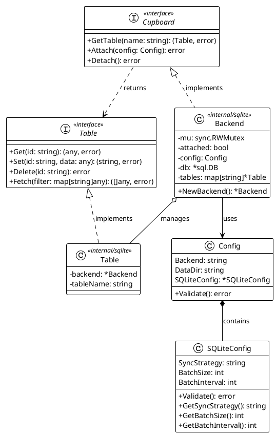
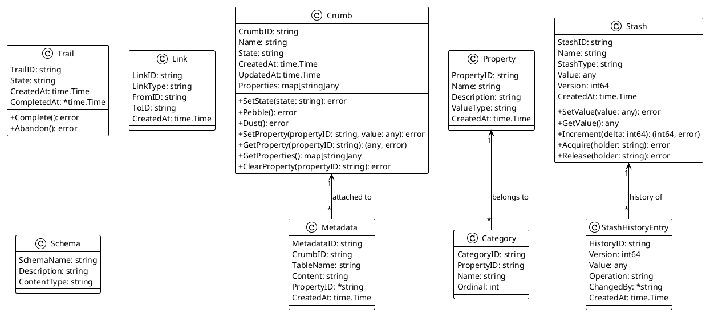

# Crumbs Architecture

## System Overview

Crumbs is a storage system for work items with first-class support for exploratory trails. The core insight is that coding agents need backtracking: an agent drops crumbs as it explores an implementation approach, and if the approach leads nowhere, the agent abandons the entire trail without polluting the permanent task list.

The system provides a Go library (`pkg/types`) for agents and a command-line tool (`cupboard` CLI) for development and personal use. Any agent that needs backtracking can use Crumbs: coding agents exploring implementation approaches, task boards, game-playing agents (chess, go), planning systems, and more. The SQLite backend is implemented. All operations use UUID v7 identifiers (time-ordered, sortable).

We use an ORM-style pattern for data access. Applications call `Cupboard.GetTable(name)` to get a table accessor, then use uniform CRUD operations (Get, Set, Delete, Fetch) that work with entity objects (Crumb, Trail, Property, etc.). Entity methods modify structs in memory; callers persist changes by calling `Table.Set`. This separates storage mechanics from domain logic and keeps the interface consistent across all entity types.



### Lifecycle of entities

Crumbs have a lifecycle driven by state transitions and trail operations. State is a core field on the Crumb struct, not a property (see prd-crumbs-interface R1, R2).

**Crumb states** (prd-crumbs-interface R2): `draft` → `pending` → `ready` → `taken` → `pebble` or `dust`. Terminal states are `pebble` (completed successfully) and `dust` (failed or abandoned). Initial state on creation is `draft`. The Table interface tracks state but does not enforce transitions—agents or coordination layers define transition rules.

**Trail states**: `draft` → `pending` → `active` → `completed` or `abandoned`. A trail in `draft` state is being planned—the agent is considering what crumbs to include but has not committed to the exploration. A trail in `pending` state is defined but waiting for some precondition (e.g., a resource or a blocking crumb) before work can begin. The `active` state indicates the trail is open for work and crumbs can be added. The `Trail.Complete()` and `Trail.Abandon()` entity methods update the trail's state field. When persisted via `Table.Set`, the backend performs cascade operations: completing a trail removes `belongs_to` links (crumbs become permanent), abandoning a trail deletes its crumbs.

**Trail structure**: Trails group crumbs via `belongs_to` links. Crumbs can depend on other crumbs via `child_of` links, forming a DAG. Trails can branch from a crumb on another trail via `branches_from` links. A crumb belongs to at most one trail at a time.

**Relationship semantics**: Each link type has distinct semantics that affect crumb and trail behavior.

| Link type | Direction | Semantics |
|-----------|-----------|-----------|
| child_of | crumb → crumb | The child crumb is blocked until the parent crumb reaches `pebble` state. This models dependencies within a trail or across trails. |
| branches_from | trail → crumb | The trail explores an alternative approach starting from that crumb. The branch point crumb remains on its original trail; the new trail represents a different path forward from that decision point. |
| belongs_to | crumb → trail | The crumb is part of that trail and follows its lifecycle. When the trail completes, the crumb becomes permanent. When the trail is abandoned, the crumb is deleted. |
| scoped_to | stash → trail | The stash is scoped to that trail and shares its lifecycle. |

|  |
|:--:|



|Figure 3 Graph model showing Link entity with four typed edges between entities |

**Trail ownership rule**: All crumbs must belong to a trail. A crumb without a `belongs_to` link is either permanent (was on a completed trail) or orphaned (should be cleaned up). When a trail is completed, the backend removes all `belongs_to` links for its crumbs—they no longer belong to any trail and become part of the permanent record. When a trail is abandoned, the backend deletes all crumbs that belong to it, along with their properties, metadata, and links.

### Coordination Pattern

Crumbs provides storage, not coordination. Agents or coordination frameworks build claiming, timeouts, and announcements on top of the Cupboard API. We expose synchronous read/write operations; agents add workflow semantics.

### Properties Model

Properties extend entities with custom attributes. We design properties as a general mechanism that applies to crumbs, trails, and stashes uniformly. The current implementation focuses on crumb properties; trail and stash properties follow the same pattern and will be added in later releases. The system enforces that every entity has a value for every defined property in its scope—there is no concept of a property being "not set" (prd-properties-interface R3.5, R3.6).

**Property types** (prd-properties-interface R3): categorical (enum from defined categories), text, integer, boolean, timestamp, list (of strings). Each type has a default value used for initialization.

**Enforcement rules**:

- When a crumb is created, all defined properties are initialized with type-based defaults (prd-crumbs-interface R3.7)
- When a property is defined, it is backfilled to all existing crumbs with the type's default value (prd-properties-interface R4.9)
- ClearProperty resets to the default value, not null (prd-crumbs-interface R12.2)

**Built-in properties** (prd-properties-interface R8): Five properties are seeded on first startup—priority (categorical), type (categorical), description (text), owner (text), labels (list). Applications can define additional properties at runtime. Note: crumb dependencies use `child_of` links, not a property.

### Stashes

Stashes enable crumbs on a trail to share state (prd-stash-interface). Unlike properties (which are attributes of individual crumbs), stashes are standalone entities scoped to a trail or global.

**Stash types** (prd-stash-interface R3): resource (files, URLs), artifact (outputs from one crumb as inputs to another), context (shared configuration), counter (atomic numeric state), lock (mutual exclusion).

**Versioning**: Every mutation increments a version number and records a history entry. The full history is queryable for auditability and debugging.

## Main Interface

The Cupboard interface is the contract between applications and storage backends (prd-cupboard-core R2). We use an ORM-style pattern: applications access data through a uniform Table interface (`GetTable`), and the Table returns entity objects (Crumb, Trail, etc.) that callers modify and persist back.

### Cupboard and Table Interfaces

The Cupboard interface provides table access and lifecycle management:

```go
type Cupboard interface {
    GetTable(name string) (Table, error)  // Access a table by name
    Attach(config Config) error            // Initialize backend
    Detach() error                         // Release resources
}
```

GetTable accepts a table name and returns a Table for that entity type. Standard table names are `crumbs`, `trails`, `properties`, `metadata`, `links`, and `stashes` (prd-cupboard-core R2.5).

The Table interface provides uniform CRUD operations:

```go
type Table interface {
    Get(id string) (any, error)              // Retrieve entity by ID
    Set(id string, data any) (string, error) // Persist entity (create or update)
    Delete(id string) error                  // Remove entity
    Fetch(filter map[string]any) ([]any, error) // Query with filter
}
```

All entity types use this same interface. Get and Fetch return `any`; callers type-assert to the appropriate entity struct (Crumb, Trail, Property, etc.). Set accepts entity structs directly. When id is empty, Set generates a UUID v7 and creates a new entity; when id is provided, Set updates the existing entity.

|  |
|:--:|



|Figure 1 Cupboard and Table interfaces with SQLite backend implementation |

### Entity Types

Entities are plain structs with fields. Entity methods (SetState, Pebble, Dust, etc.) modify the struct in memory; callers must call `Table.Set` to persist changes. This separates data access from business logic.

| Entity | Description | Key fields | PRD |
|--------|-------------|------------|-----|
| Crumb | Work item | CrumbID, Name, State, CreatedAt, UpdatedAt, Properties | prd-crumbs-interface |
| Trail | Exploration session | TrailID, State, CreatedAt, CompletedAt | prd-trails-interface |
| Property | Property definition | PropertyID, Name, ValueType, Description, CreatedAt | prd-properties-interface |
| Category | Categorical value | CategoryID, PropertyID, Name, Ordinal | prd-properties-interface |
| Stash | Shared state | StashID, Name, StashType, Value, Version, CreatedAt | prd-stash-interface |
| Metadata | Supplementary data | MetadataID, CrumbID, TableName, Content, PropertyID, CreatedAt | prd-metadata-interface |
| Link | Graph edge | LinkID, LinkType, FromID, ToID, CreatedAt | prd-sqlite-backend |

Relationships use the links table (Decision 10): `branches_from` (trail→crumb branch point), `scoped_to` (stash→trail scope), `belongs_to` (crumb→trail membership), `child_of` (crumb→crumb dependencies).

|  |
|:--:|



|Figure 2 Entity types with fields, methods, and relationships |

### Usage Pattern

The ORM pattern follows get-modify-set:

```go
// 1. Get the table
table, _ := cupboard.GetTable("crumbs")

// 2. Create a new entity
crumb := &Crumb{Name: "Implement feature X"}
id, _ := table.Set("", crumb)  // Empty ID triggers creation

// 3. Retrieve and modify
entity, _ := table.Get(id)
crumb = entity.(*Crumb)        // Type assertion
crumb.SetState("taken")        // Entity method updates struct
crumb.SetProperty("priority", "high")

// 4. Persist changes
table.Set(crumb.CrumbID, crumb)

// 5. Query with filter
entities, _ := table.Fetch(map[string]any{"states": []string{"ready"}})
for _, e := range entities {
    c := e.(*Crumb)
    // process crumb
}
```

### Lifecycle Operations

| Operation | Purpose |
|-----------|---------|
| Attach(config) | Initialize backend connection; validates config |
| Detach() | Release resources; subsequent operations return ErrCupboardDetached |

Attach is idempotent (returns ErrAlreadyAttached if called twice). Detach blocks until in-flight operations complete.

## System Components

**Cupboard API (pkg/types)**: Public types and interfaces. Applications import this package to use the Cupboard interface, Table interface, and entity types (Crumb, Trail, Property, Category, Stash, Metadata, Link). The Cupboard interface provides `GetTable(name)` which returns a uniform Table interface for any entity type (prd-cupboard-core R2, R3).

**Entity Types (pkg/types)**: Structs representing domain objects. Each entity has an ID field (UUID v7) and domain-specific fields. Entity methods (e.g., `Crumb.SetState`, `Crumb.Pebble`, `Trail.Complete`) modify the struct in memory; callers persist via `Table.Set`. Entity types are defined in their respective PRDs.

**SQLite Backend (internal/sqlite)**: Primary backend for local development. JSONL files are the source of truth; SQLite (modernc.org/sqlite, pure Go) serves as a query cache. On startup, JSONL is loaded into SQLite. Writes persist to JSONL first, then update SQLite. Implements the Cupboard and Table interfaces (prd-sqlite-backend). Hydrates table rows into entity objects on Get/Fetch, and dehydrates entity objects to rows on Set.

**CLI (cmd/cupboard)**: Command-line tool for development and personal use. Commands map to Cupboard operations. Config file selects backend.

## Design Decisions

**Decision 1: UUID v7 for all identifiers**. We chose UUID v7 (time-ordered UUIDs per RFC 9562) because they are sortable by creation time without separate timestamp columns. This simplifies pagination, reduces index size, and works across distributed backends. Alternative: auto-increment IDs are not suitable for distributed systems; UUID v4 lacks time ordering.

**Decision 2: Properties as first-class entities**. Property definitions have their own IDs and table. This enables runtime extensibility—agents define new properties without schema migrations. Type-specific tables (categorical, text, integer, list) enforce value types and enable efficient queries. Alternative: storing properties as JSON blobs is less queryable and loses type safety.

**Decision 3: Trails with complete/abandon semantics**. Trails represent agent exploration sessions. CompleteTrail merges crumbs into the permanent record by clearing trail_id. AbandonTrail removes crumbs entirely (backtracking). This keeps the permanent task list clean and makes agent exploration explicit—try an approach, abandon if it fails, complete if it succeeds. Alternative: marking crumbs as "tentative" is less clear and requires agents to manually track and clean up failed explorations.

**Decision 4: Pluggable backends with full interface**. Each backend implements the entire Cupboard interface. This allows backend-specific optimizations without leaking details into the API. Alternative: a generic SQL backend with schema generation is less flexible and cannot leverage backend-specific features.

**Decision 5: Synchronous API**. Operations are synchronous for simplicity. Alternative: async adds complexity before we need it.

**Decision 6: JSONL as source of truth for SQLite backend**. The SQLite backend uses JSONL files (one JSON object per line) as the canonical data store. SQLite (modernc.org/sqlite, pure Go) serves as a query engine to reuse SQL code across backends and avoid reimplementing filtering, joins, and indexing. On startup, we load JSONL into SQLite; on writes, we persist back to JSONL. This gives us human-readable files, easy backup, and code reuse. The sync strategy is configurable via SQLiteConfig: "immediate" (default, safest), "on_close" (deferred, higher performance), or "batch" (batched by count or interval). See prd-sqlite-backend R16. Alternative: raw JSON with custom query logic duplicates work that SQL handles well; pure SQLite loses the human-readable file benefit.

**Decision 7: Properties always present with type-based defaults**. Every crumb has a value for every defined property. When a property is defined, existing crumbs are backfilled with the type's default value. When a crumb is created, all properties are initialized. This eliminates null-checking complexity and ensures consistent schema across all crumbs. Alternative: allowing "not set" properties requires null handling everywhere and makes queries more complex (filtering on missing vs present values).

**Decision 8: Stashes as separate entities for shared state**. Crumbs are individual work items with properties. When multiple crumbs on a trail need to share state (resources, artifacts, coordination primitives), we use stashes—not "special crumbs" or property values. Stashes are versioned with full history, supporting auditability and debugging. Alternative: encoding shared state in crumb properties conflates task attributes with coordination state; using external storage loses the trail-scoped lifecycle.

**Decision 9: ORM-style pattern with uniform Table interface**. We use a single Table interface (Get, Set, Delete, Fetch) for all entity types rather than entity-specific interfaces (CrumbTable, TrailTable, etc.). `Cupboard.GetTable(name)` returns the same Table interface regardless of entity type; Get and Fetch return entity objects that callers type-assert. Entity methods modify structs in memory; callers persist via `Table.Set`. Benefits: consistent API across all entities, simpler backend implementation (one interface to implement per table), clear separation between storage operations and domain logic. Entity-specific behavior lives in entity methods, not in specialized table interfaces. Alternative: entity-specific interfaces (CrumbTable with Add, Archive, Purge; TrailTable with Start, Complete, Abandon) create a larger API surface, duplicate CRUD patterns, and mix storage concerns with domain logic.

**Decision 10: Links table for all relationships**. All entity relationships use the links table with typed edges. Link types: `belongs_to` (crumb→trail membership), `child_of` (crumb→crumb dependencies), `branches_from` (trail→crumb branch point), `scoped_to` (stash→trail scope). Benefits: one consistent pattern for all relationships, enables graph queries and traversal, no special cases. Alternative: direct fields (e.g., `Trail.ParentCrumbID`, `Stash.TrailID`) are simpler for 1:optional relationships but create inconsistency and require different query patterns.

## Technology Choices

| Component | Technology | Purpose |
|-----------|------------|---------|
| Language | Go | CLI tool and library; strong concurrency, static typing |
| Identifiers | UUID v7 (RFC 9562) | Time-ordered, sortable, distributed-safe IDs |
| CLI | cobra + viper | Command parsing and config management |
| SQLite backend | modernc.org/sqlite | JSONL files as source of truth, SQLite as query engine |
| Testing | Go testing + testify | Unit and integration tests |

## Implementation Status

Release 01.0 (core storage with SQLite backend) is complete. Releases 01.1, 02.1, and 03.0 are in progress with several use cases done. See road-map.yaml for the full release schedule, use case status, and prioritization rules.

Success criteria (from VISION): operations complete with low latency, agents integrate the library quickly, trail workflows feel natural for coding agents exploring implementation approaches.

## Related Documents

| Document | Purpose |
|----------|---------|
| VISION.md | What we are building and why; success criteria and boundaries |
| road-map.yaml | Release schedule, use cases, prioritization rules |
| prd-cupboard-core.yaml | Cupboard interface, configuration, lifecycle |
| prd-sqlite-backend.yaml | SQLite backend internals, JSON↔SQLite sync, graph model |
| prd-crumbs-interface.yaml | Crumb entity, state transitions, property methods |
| prd-trails-interface.yaml | Trail entity, lifecycle methods, crumb membership |
| prd-properties-interface.yaml | Property and Category entities, value types |
| prd-metadata-interface.yaml | Metadata entity, schema registration |
| prd-stash-interface.yaml | Stash entity, shared state, versioning |
| engineering/eng01-git-integration.md | Git conventions: JSONL in git, task branches, trails vs git branches, merge behavior |
| engineering/eng02-generation-workflow.md | Generation lifecycle: open, generate, close; task branch naming; scripts |

## References

- RFC 9562: UUID v7 specification
