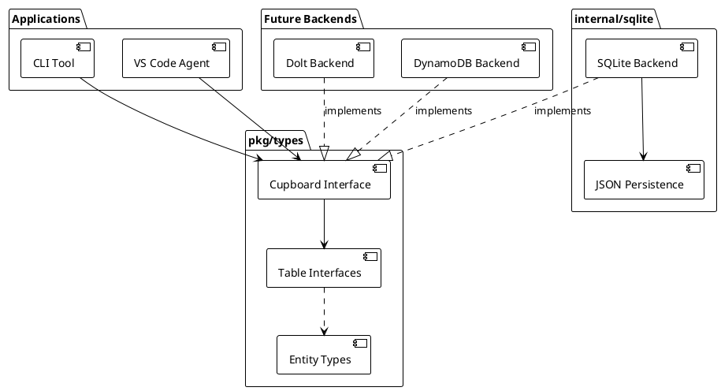

# Crumbs Architecture

## System Overview

Crumbs is a storage system for work items with first-class support for exploratory trails. The core insight is that coding agents need backtracking: an agent drops crumbs as it explores an implementation approach, and if the approach leads nowhere, the agent abandons the entire trail without polluting the permanent task list.

The system provides a Go library (`pkg/cupboard`) for agents and a command-line tool (`crumbs` CLI) for development and personal use. The primary use case is a VS Code coding agent that uses trails to explore implementation approaches. Storage is pluggable—SQLite for local development, Dolt for version control, DynamoDB for cloud scale. All operations are asynchronous and use UUID v7 identifiers (time-ordered, sortable). Backend selection happens via configuration at startup.



### Lifecycle

Crumbs have a lifecycle driven by state transitions and trail operations. State is a core field on the Crumb struct, not a property (see prd-crumbs-interface R1, R2).

**Crumb states** (prd-crumbs-interface R2): `draft` → `pending` → `ready` → `taken` → `completed` or `failed` → `archived`. Initial state on creation is `draft`. CrumbTable tracks state but does not enforce transitions—agents or coordination layers define transition rules.

**Trail states** (prd-trails-interface R2): `active` → `completed` or `abandoned`. When a trail completes, belongs_to links are removed and crumbs become permanent. When a trail is abandoned, all crumbs on the trail are deleted—the exploration failed and you backtrack.

**Trail structure**: Trails group crumbs via belongs_to links (prd-sqlite-backend). Crumbs within a trail can have explicit dependency relationships via the dependencies property. Trails can branch—a new trail can deviate from a crumb on an existing trail (recorded via ParentCrumbID on the Trail struct). A crumb belongs to at most one trail at a time.

### Coordination Pattern

Crumbs provides storage, not coordination. Agents or coordination frameworks build claiming, timeouts, and announcements on top of the Cupboard API. We expose async read/write operations; agents add workflow semantics.

### Properties Model

Properties extend crumbs with custom attributes. The system enforces that every crumb has a value for every defined property—there is no concept of a property being "not set" (prd-properties-interface R3.5, R3.6).

**Property types** (prd-properties-interface R3): categorical (enum from defined categories), text, integer, boolean, timestamp, list (of strings). Each type has a default value used for initialization.

**Enforcement rules**:

- When a crumb is created, all defined properties are initialized with type-based defaults (prd-crumbs-interface R3.7)
- When a property is defined, it is backfilled to all existing crumbs with the type's default value (prd-properties-interface R4.9)
- ClearProperty resets to the default value, not null (prd-crumbs-interface R12.2)

**Built-in properties** (prd-properties-interface R8): Six properties are seeded on first startup—priority (categorical), type (categorical), description (text), owner (text), labels (list), dependencies (list). Applications can define additional properties at runtime.

### Stashes

Stashes enable crumbs on a trail to share state (prd-stash-interface). Unlike properties (which are attributes of individual crumbs), stashes are standalone entities scoped to a trail or global.

**Stash types** (prd-stash-interface R3): resource (files, URLs), artifact (outputs from one crumb as inputs to another), context (shared configuration), counter (atomic numeric state), lock (mutual exclusion).

**Versioning**: Every mutation increments a version number and records a history entry. The full history is queryable for auditability and debugging.

## Main Interface

The Cupboard interface is the contract between applications and storage backends (prd-cupboard-core R2). Operations are grouped into table accessors: `Crumbs()`, `Trails()`, `Properties()`, `Metadata()`, `Links()`, and `Stashes()`. Each accessor returns a table-specific interface.

### Data Structures

| Type | Description | Key fields |
|------|-------------|------------|
| Crumb | Work item | CrumbID (UUID v7), Name, State, CreatedAt, UpdatedAt |
| Trail | Exploration session | TrailID (UUID v7), ParentCrumbID, State, CreatedAt, CompletedAt |
| Property | Property definition | PropertyID (UUID v7), Name, ValueType, Description, CreatedAt |
| Category | Categorical value | CategoryID (UUID v7), PropertyID, Name, Ordinal |
| Stash | Shared state | StashID (UUID v7), TrailID, Name, StashType, Value, Version |

Full field specs are in the interface PRDs (prd-crumbs-interface, prd-trails-interface, prd-properties-interface, prd-stash-interface).

### Table Interfaces

| Table | Operations | PRD |
|-------|------------|-----|
| CrumbTable | Add, Get, Update, SetState, Archive, Purge, Fetch, SetProperty, GetProperty, GetProperties, ClearProperty | prd-crumbs-interface |
| TrailTable | Start, Get, GetCrumbs, AddCrumb, RemoveCrumb, Complete, Abandon | prd-trails-interface |
| PropertyTable | Define, Get, List, DefineCategory, ListCategories | prd-properties-interface |
| MetadataTable | Register, Add, Get, Search | prd-metadata-interface |
| LinkTable | Add, Remove, GetByFrom, GetByTo | prd-sqlite-backend |
| StashTable | Create, Get, GetByName, List, Delete, Set, GetValue, Increment, Acquire, Release, TryAcquire, GetHistory, GetValueAtVersion | prd-stash-interface |

### Lifecycle Operations

| Operation | Purpose |
|-----------|---------|
| OpenCupboard(config) | Initialize storage backend; returns Cupboard instance |
| Close() | Release resources; subsequent operations return ErrCupboardClosed |

## System Components

**Cupboard API (pkg/types)**: Public types and interfaces. Applications import this package to use the Cupboard interface and entity types (Crumb, Trail, Property, Stash). The Cupboard interface provides table accessors (Crumbs(), Trails(), etc.) that return table-specific interfaces (prd-cupboard-core R2).

**SQLite Backend (internal/sqlite)**: Primary backend for local development. JSON files are the source of truth; SQLite (modernc.org/sqlite, pure Go) serves as a query cache. On startup, JSON is loaded into SQLite. Writes persist to JSON first, then update SQLite. Implements all table interfaces (prd-sqlite-backend).

**Stash Manager**: Part of the SQLite backend. Manages stashes for sharing state between crumbs on a trail. Supports resource, artifact, context, counter, and lock stash types. Maintains versioned history of all changes (prd-stash-interface).

**CLI (cmd/crumbs)**: Command-line tool for development and personal use. Commands map to Cupboard operations. Config file selects backend.

**Future Backends**: Dolt backend (SQL with version control) and DynamoDB backend (serverless NoSQL) are planned but not yet implemented. Each backend implements the full Cupboard interface (prd-cupboard-core R6).

## Design Decisions

**Decision 1: UUID v7 for all identifiers**. We chose UUID v7 (time-ordered UUIDs per RFC 9562) because they are sortable by creation time without separate timestamp columns. This simplifies pagination, reduces index size, and works across distributed backends. Alternative: auto-increment IDs are not suitable for distributed systems; UUID v4 lacks time ordering.

**Decision 2: Properties as first-class entities**. Property definitions have their own IDs and table. This enables runtime extensibility—agents define new properties without schema migrations. Type-specific tables (categorical, text, integer, list) enforce value types and enable efficient queries. Alternative: storing properties as JSON blobs is less queryable and loses type safety.

**Decision 3: Trails with complete/abandon semantics**. Trails represent agent exploration sessions. CompleteTrail merges crumbs into the permanent record by clearing trail_id. AbandonTrail removes crumbs entirely (backtracking). This keeps the permanent task list clean and makes agent exploration explicit—try an approach, abandon if it fails, complete if it succeeds. Alternative: marking crumbs as "tentative" is less clear and requires agents to manually track and clean up failed explorations.

**Decision 4: Pluggable backends with full interface**. Each backend implements the entire Cupboard interface. This allows backend-specific optimizations (Dolt version history, DynamoDB single-table design) without leaking details into the API. Alternative: a generic SQL backend with schema generation is less flexible and cannot leverage backend-specific features.

**Decision 5: Asynchronous API**. All operations return futures or use async/await patterns. This supports backends with network calls (DynamoDB) and keeps the CLI responsive. Backends may implement operations synchronously internally if local. Alternative: synchronous API is simpler but blocks on I/O and does not scale to remote backends.

**Decision 6: JSON as source of truth for SQLite backend**. The SQLite backend uses JSON files as the canonical data store. SQLite (modernc.org/sqlite, pure Go) serves as a query engine to reuse SQL code across backends and avoid reimplementing filtering, joins, and indexing. On startup, we load JSON into SQLite; on writes, we persist back to JSON. This gives us human-readable files, easy backup, and code reuse. Alternative: raw JSON with custom query logic duplicates work that SQL handles well; pure SQLite loses the human-readable file benefit.

**Decision 7: Properties always present with type-based defaults**. Every crumb has a value for every defined property. When a property is defined, existing crumbs are backfilled with the type's default value. When a crumb is created, all properties are initialized. This eliminates null-checking complexity and ensures consistent schema across all crumbs. Alternative: allowing "not set" properties requires null handling everywhere and makes queries more complex (filtering on missing vs present values).

**Decision 8: Stashes as separate entities for shared state**. Crumbs are individual work items with properties. When multiple crumbs on a trail need to share state (resources, artifacts, coordination primitives), we use stashes—not "special crumbs" or property values. Stashes are versioned with full history, supporting auditability and debugging. Alternative: encoding shared state in crumb properties conflates task attributes with coordination state; using external storage loses the trail-scoped lifecycle.

## Technology Choices

| Component | Technology | Purpose |
|-----------|------------|---------|
| Language | Go | CLI tool and library; strong concurrency, static typing |
| Identifiers | UUID v7 (RFC 9562) | Time-ordered, sortable, distributed-safe IDs |
| CLI | cobra + viper | Command parsing and config management |
| SQLite backend | modernc.org/sqlite | Local development; JSON files as source of truth, SQLite as query engine |
| Dolt backend | go-mysql-driver + Dolt SQL | Version-controlled relational storage |
| DynamoDB backend | AWS SDK for Go v2 | Serverless NoSQL cloud storage |
| Testing | Go testing + testify | Unit and integration tests |
| Async | Goroutines + channels | Concurrent operations, future-like patterns |

## Project Structure

```
crumbs/
├── cmd/
│   └── crumbs/              # CLI entry point
├── pkg/
│   └── types/               # Public API: Cupboard interface, entity types
├── internal/
│   └── sqlite/              # SQLite backend implementation
├── docs/
│   ├── VISION.md
│   ├── ARCHITECTURE.md
│   ├── product-requirements/
│   │   ├── prd-cupboard-core.md
│   │   ├── prd-sqlite-backend.md
│   │   ├── prd-crumbs-interface.md
│   │   ├── prd-trails-interface.md
│   │   ├── prd-properties-interface.md
│   │   ├── prd-metadata-interface.md
│   │   └── prd-stash-interface.md
│   └── use-cases/
│       └── uc-crud-operations.md
└── .claude/                 # Project rules and commands
```

**pkg/types**: Public API. Applications import this package to access the Cupboard interface and all entity types (Crumb, Trail, Property, Category, Stash, etc.). Contains no implementation.

**internal/sqlite**: SQLite backend implementation. Implements all table interfaces (CrumbTable, TrailTable, PropertyTable, MetadataTable, LinkTable, StashTable). JSON files are the source of truth; SQLite is a query cache.

**cmd/crumbs**: CLI tool. Parses commands, loads config, opens Cupboard, and invokes operations.

## Implementation Status

We are currently in the bootstrap phase. Implementation will proceed in phases:

**Phase 1: Core storage with SQLite backend**. Implement Cupboard interface, CrumbTable (Add, Get, Update, SetState, Archive, Purge, Fetch), SQLite backend with JSON persistence, basic CLI commands. Validates core concepts and provides a working system for local use.

**Phase 2: Properties with enforcement**. Implement PropertyTable (Define, Get, List, DefineCategory, ListCategories), property operations on CrumbTable (SetProperty, GetProperty, GetProperties, ClearProperty), built-in property seeding, and property enforcement (auto-initialization on crumb creation, backfill on property definition). Enables extensibility without schema changes.

**Phase 3: Trails and stashes**. Implement TrailTable (Start, Get, GetCrumbs, AddCrumb, RemoveCrumb, Complete, Abandon) and StashTable (Create, Get, Set, Increment, Acquire, Release, history operations). Add trail filtering to Fetch. Validates the exploratory workflow and shared state coordination.

**Phase 4: Metadata and additional backends**. Implement MetadataTable for extensible metadata. Add Dolt backend (version control) and DynamoDB backend (cloud scale). Validates pluggable architecture and backend-specific optimizations.

Success criteria (from VISION): operations complete with low latency, agents integrate the library quickly, trail workflows feel natural for coding agents exploring implementation approaches.

## Related Documents

| Document | Purpose |
|----------|---------|
| VISION.md | What we are building and why; success criteria and boundaries |
| prd-cupboard-core.md | Cupboard interface, configuration, lifecycle |
| prd-sqlite-backend.md | SQLite backend internals, JSON↔SQLite sync, graph model |
| prd-crumbs-interface.md | CrumbTable operations |
| prd-trails-interface.md | TrailTable operations |
| prd-properties-interface.md | PropertyTable operations |
| prd-metadata-interface.md | MetadataTable operations |
| prd-stash-interface.md | StashTable operations for shared state |
| uc-crud-operations.md | Tracer bullet for core CRUD operations |
| uc-self-hosting.md | Milestone: crumbs builds crumbs |

## References

- RFC 9562: UUID v7 specification
- Dolt documentation: SQL with Git semantics
- DynamoDB best practices: Single-table design, GSI patterns
