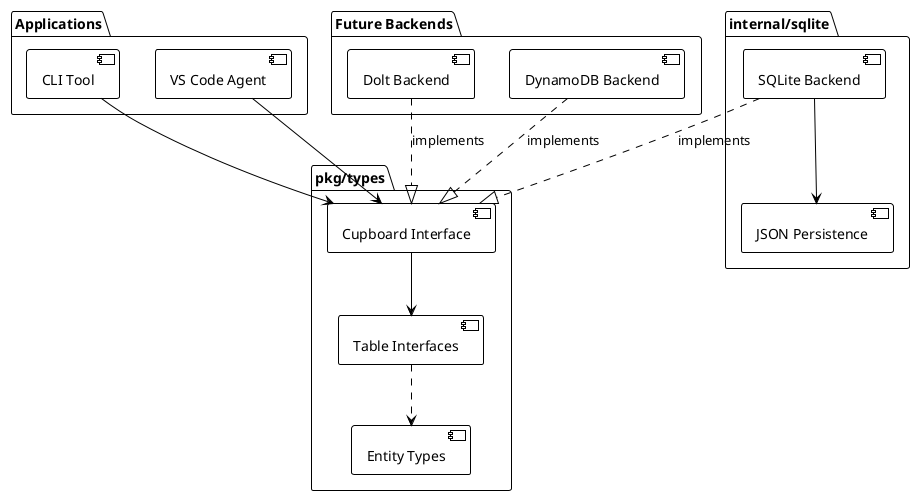

# Crumbs Architecture

## System Overview

Crumbs is a storage system for work items with first-class support for exploratory trails. The core insight is that coding agents need backtracking: an agent drops crumbs as it explores an implementation approach, and if the approach leads nowhere, the agent abandons the entire trail without polluting the permanent task list.

The system provides a Go library (`pkg/types`) for agents and a command-line tool (`crumbs` CLI) for development and personal use. The primary use case is a VS Code coding agent that uses trails to explore implementation approaches. Storage is pluggable—SQLite for local development, Dolt for version control, DynamoDB for cloud scale. All operations use UUID v7 identifiers (time-ordered, sortable). Backend selection happens via configuration at startup.

We use an ORM-style pattern for data access. Applications call `Cupboard.GetTable(name)` to get a table accessor, then use uniform CRUD operations (Get, Set, Delete, Fetch) that work with entity objects (Crumb, Trail, Property, etc.). Entity methods modify structs in memory; callers persist changes by calling `Table.Set`. This separates storage mechanics from domain logic and keeps the interface consistent across all entity types.



### Lifecycle

Crumbs have a lifecycle driven by state transitions and trail operations. State is a core field on the Crumb struct, not a property (see prd-crumbs-interface R1, R2).

**Crumb states** (prd-crumbs-interface R2): `draft` → `pending` → `ready` → `taken` → `completed` or `failed` → `archived`. Initial state on creation is `draft`. CrumbTable tracks state but does not enforce transitions—agents or coordination layers define transition rules.

**Trail states** (prd-trails-interface R2): `active` → `completed` or `abandoned`. When a trail completes, belongs_to links are removed and crumbs become permanent. When a trail is abandoned, all crumbs on the trail are deleted—the exploration failed and you backtrack.

**Trail structure**: Trails group crumbs via belongs_to links (prd-sqlite-backend). Crumbs within a trail can have explicit dependency relationships via the dependencies property. Trails can branch—a new trail can deviate from a crumb on an existing trail (recorded via ParentCrumbID on the Trail struct). A crumb belongs to at most one trail at a time.

### Coordination Pattern

Crumbs provides storage, not coordination. Agents or coordination frameworks build claiming, timeouts, and announcements on top of the Cupboard API. We expose async read/write operations; agents add workflow semantics.

### Properties Model

Properties extend crumbs with custom attributes. The system enforces that every crumb has a value for every defined property—there is no concept of a property being "not set" (prd-properties-interface R3.5, R3.6).

**Property types** (prd-properties-interface R3): categorical (enum from defined categories), text, integer, boolean, timestamp, list (of strings). Each type has a default value used for initialization.

**Enforcement rules**:

- When a crumb is created, all defined properties are initialized with type-based defaults (prd-crumbs-interface R3.7)
- When a property is defined, it is backfilled to all existing crumbs with the type's default value (prd-properties-interface R4.9)
- ClearProperty resets to the default value, not null (prd-crumbs-interface R12.2)

**Built-in properties** (prd-properties-interface R8): Six properties are seeded on first startup—priority (categorical), type (categorical), description (text), owner (text), labels (list), dependencies (list). Applications can define additional properties at runtime.

### Stashes

Stashes enable crumbs on a trail to share state (prd-stash-interface). Unlike properties (which are attributes of individual crumbs), stashes are standalone entities scoped to a trail or global.

**Stash types** (prd-stash-interface R3): resource (files, URLs), artifact (outputs from one crumb as inputs to another), context (shared configuration), counter (atomic numeric state), lock (mutual exclusion).

**Versioning**: Every mutation increments a version number and records a history entry. The full history is queryable for auditability and debugging.

## Main Interface

The Cupboard interface is the contract between applications and storage backends (prd-cupboard-core R2). We use an ORM-style pattern: applications access data through a uniform Table interface (`GetTable`), and the Table returns entity objects (Crumb, Trail, etc.) that callers modify and persist back.

### Cupboard and Table Interfaces

The Cupboard interface provides table access and lifecycle management:

```go
type Cupboard interface {
    GetTable(name string) (Table, error)  // Access a table by name
    Attach(config Config) error            // Initialize backend
    Detach() error                         // Release resources
}
```

GetTable accepts a table name and returns a Table for that entity type. Standard table names are `crumbs`, `trails`, `properties`, `metadata`, `links`, and `stashes` (prd-cupboard-core R2.5).

The Table interface provides uniform CRUD operations:

```go
type Table interface {
    Get(id string) (any, error)              // Retrieve entity by ID
    Set(id string, data any) (string, error) // Persist entity (create or update)
    Delete(id string) error                  // Remove entity
    Fetch(filter map[string]any) ([]any, error) // Query with filter
}
```

All entity types use this same interface. Get and Fetch return `any`; callers type-assert to the appropriate entity struct (Crumb, Trail, Property, etc.). Set accepts entity structs directly. When id is empty, Set generates a UUID v7 and creates a new entity; when id is provided, Set updates the existing entity.

### Entity Types

Entities are plain structs with fields. Entity methods (SetState, Complete, etc.) modify the struct in memory; callers must call `Table.Set` to persist changes. This separates data access from business logic.

| Entity | Description | Key fields | PRD |
|--------|-------------|------------|-----|
| Crumb | Work item | CrumbID, Name, State, CreatedAt, UpdatedAt, Properties | prd-crumbs-interface |
| Trail | Exploration session | TrailID, ParentCrumbID, State, CreatedAt, CompletedAt | prd-trails-interface |
| Property | Property definition | PropertyID, Name, ValueType, Description, CreatedAt | prd-properties-interface |
| Category | Categorical value | CategoryID, PropertyID, Name, Ordinal | prd-properties-interface |
| Stash | Shared state | StashID, TrailID, Name, StashType, Value, Version, CreatedAt | prd-stash-interface |
| Metadata | Supplementary data | MetadataID, CrumbID, TableName, Content, PropertyID, CreatedAt | prd-metadata-interface |
| Link | Graph edge | LinkID, LinkType, FromID, ToID, CreatedAt | prd-sqlite-backend |

### Usage Pattern

The ORM pattern follows get-modify-set:

```go
// 1. Get the table
table, _ := cupboard.GetTable("crumbs")

// 2. Create a new entity
crumb := &Crumb{Name: "Implement feature X"}
id, _ := table.Set("", crumb)  // Empty ID triggers creation

// 3. Retrieve and modify
entity, _ := table.Get(id)
crumb = entity.(*Crumb)        // Type assertion
crumb.SetState("taken")        // Entity method updates struct
crumb.SetProperty("priority", "high")

// 4. Persist changes
table.Set(crumb.CrumbID, crumb)

// 5. Query with filter
entities, _ := table.Fetch(map[string]any{"State": "ready"})
for _, e := range entities {
    c := e.(*Crumb)
    // process crumb
}
```

### Lifecycle Operations

| Operation | Purpose |
|-----------|---------|
| Attach(config) | Initialize backend connection; validates config |
| Detach() | Release resources; subsequent operations return ErrCupboardDetached |

Attach is idempotent (returns ErrAlreadyAttached if called twice). Detach blocks until in-flight operations complete.

## System Components

**Cupboard API (pkg/types)**: Public types and interfaces. Applications import this package to use the Cupboard interface, Table interface, and entity types (Crumb, Trail, Property, Category, Stash, Metadata, Link). The Cupboard interface provides `GetTable(name)` which returns a uniform Table interface for any entity type (prd-cupboard-core R2, R3).

**Entity Types (pkg/types)**: Structs representing domain objects. Each entity has an ID field (UUID v7) and domain-specific fields. Entity methods (e.g., `Crumb.SetState`, `Trail.Complete`) modify the struct in memory; callers persist via `Table.Set`. Entity types are defined in their respective PRDs.

**SQLite Backend (internal/sqlite)**: Primary backend for local development. JSON files are the source of truth; SQLite (modernc.org/sqlite, pure Go) serves as a query cache. On startup, JSON is loaded into SQLite. Writes persist to JSON first, then update SQLite. Implements the Cupboard and Table interfaces (prd-sqlite-backend). Hydrates table rows into entity objects on Get/Fetch, and dehydrates entity objects to rows on Set.

**CLI (cmd/crumbs)**: Command-line tool for development and personal use. Commands map to Cupboard operations. Config file selects backend.

**Future Backends**: Dolt backend (SQL with version control) and DynamoDB backend (serverless NoSQL) are planned but not yet implemented. Each backend implements the full Cupboard interface (prd-cupboard-core).

## Design Decisions

**Decision 1: UUID v7 for all identifiers**. We chose UUID v7 (time-ordered UUIDs per RFC 9562) because they are sortable by creation time without separate timestamp columns. This simplifies pagination, reduces index size, and works across distributed backends. Alternative: auto-increment IDs are not suitable for distributed systems; UUID v4 lacks time ordering.

**Decision 2: Properties as first-class entities**. Property definitions have their own IDs and table. This enables runtime extensibility—agents define new properties without schema migrations. Type-specific tables (categorical, text, integer, list) enforce value types and enable efficient queries. Alternative: storing properties as JSON blobs is less queryable and loses type safety.

**Decision 3: Trails with complete/abandon semantics**. Trails represent agent exploration sessions. CompleteTrail merges crumbs into the permanent record by clearing trail_id. AbandonTrail removes crumbs entirely (backtracking). This keeps the permanent task list clean and makes agent exploration explicit—try an approach, abandon if it fails, complete if it succeeds. Alternative: marking crumbs as "tentative" is less clear and requires agents to manually track and clean up failed explorations.

**Decision 4: Pluggable backends with full interface**. Each backend implements the entire Cupboard interface. This allows backend-specific optimizations (Dolt version history, DynamoDB single-table design) without leaking details into the API. Alternative: a generic SQL backend with schema generation is less flexible and cannot leverage backend-specific features.

**Decision 5: Asynchronous API**. All operations return futures or use async/await patterns. This supports backends with network calls (DynamoDB) and keeps the CLI responsive. Backends may implement operations synchronously internally if local. Alternative: synchronous API is simpler but blocks on I/O and does not scale to remote backends.

**Decision 6: JSON as source of truth for SQLite backend**. The SQLite backend uses JSON files as the canonical data store. SQLite (modernc.org/sqlite, pure Go) serves as a query engine to reuse SQL code across backends and avoid reimplementing filtering, joins, and indexing. On startup, we load JSON into SQLite; on writes, we persist back to JSON. This gives us human-readable files, easy backup, and code reuse. Alternative: raw JSON with custom query logic duplicates work that SQL handles well; pure SQLite loses the human-readable file benefit.

**Decision 7: Properties always present with type-based defaults**. Every crumb has a value for every defined property. When a property is defined, existing crumbs are backfilled with the type's default value. When a crumb is created, all properties are initialized. This eliminates null-checking complexity and ensures consistent schema across all crumbs. Alternative: allowing "not set" properties requires null handling everywhere and makes queries more complex (filtering on missing vs present values).

**Decision 8: Stashes as separate entities for shared state**. Crumbs are individual work items with properties. When multiple crumbs on a trail need to share state (resources, artifacts, coordination primitives), we use stashes—not "special crumbs" or property values. Stashes are versioned with full history, supporting auditability and debugging. Alternative: encoding shared state in crumb properties conflates task attributes with coordination state; using external storage loses the trail-scoped lifecycle.

**Decision 9: ORM-style pattern with uniform Table interface**. We use a single Table interface (Get, Set, Delete, Fetch) for all entity types rather than entity-specific interfaces (CrumbTable, TrailTable, etc.). `Cupboard.GetTable(name)` returns the same Table interface regardless of entity type; Get and Fetch return entity objects that callers type-assert. Entity methods modify structs in memory; callers persist via `Table.Set`. Benefits: consistent API across all entities, simpler backend implementation (one interface to implement per table), clear separation between storage operations and domain logic. Entity-specific behavior lives in entity methods, not in specialized table interfaces. Alternative: entity-specific interfaces (CrumbTable with Add, Archive, Purge; TrailTable with Start, Complete, Abandon) create a larger API surface, duplicate CRUD patterns, and mix storage concerns with domain logic.

## Technology Choices

| Component | Technology | Purpose |
|-----------|------------|---------|
| Language | Go | CLI tool and library; strong concurrency, static typing |
| Identifiers | UUID v7 (RFC 9562) | Time-ordered, sortable, distributed-safe IDs |
| CLI | cobra + viper | Command parsing and config management |
| SQLite backend | modernc.org/sqlite | Local development; JSON files as source of truth, SQLite as query engine |
| Dolt backend | go-mysql-driver + Dolt SQL | Version-controlled relational storage |
| DynamoDB backend | AWS SDK for Go v2 | Serverless NoSQL cloud storage |
| Testing | Go testing + testify | Unit and integration tests |
| Async | Goroutines + channels | Concurrent operations, future-like patterns |

## Project Structure

```
crumbs/
├── cmd/
│   └── crumbs/              # CLI entry point
├── pkg/
│   └── types/               # Public API: Cupboard interface, entity types
├── internal/
│   └── sqlite/              # SQLite backend implementation
├── docs/
│   ├── VISION.md
│   ├── ARCHITECTURE.md
│   ├── product-requirements/
│   │   ├── prd-cupboard-core.md
│   │   ├── prd-sqlite-backend.md
│   │   ├── prd-crumbs-interface.md
│   │   ├── prd-trails-interface.md
│   │   ├── prd-properties-interface.md
│   │   ├── prd-metadata-interface.md
│   │   └── prd-stash-interface.md
│   └── use-cases/
│       └── rel01.0-uc001-cupboard-lifecycle.md
└── .claude/                 # Project rules and commands
```

**pkg/types**: Public API. Applications import this package to access the Cupboard interface, Table interface, and all entity types (Crumb, Trail, Property, Category, Stash, Metadata, Link). Contains interfaces and structs only; no implementation.

**internal/sqlite**: SQLite backend implementation. Implements the Cupboard and Table interfaces for all entity types. Handles entity hydration (row to struct) and dehydration (struct to row). JSON files are the source of truth; SQLite is a query cache.

**cmd/crumbs**: CLI tool. Parses commands, loads config, calls Attach, and invokes Table operations.

## Implementation Status

We are currently in the bootstrap release. Implementation will proceed in releases:

**Release 01.0: Core storage with SQLite backend**. Implement Cupboard interface with GetTable, Table interface (Get, Set, Delete, Fetch), entity types (Crumb, Trail, etc.), SQLite backend with JSON persistence, basic CLI commands. Validates core concepts and provides a working system for local use.

**Release 02.0: Properties with enforcement**. Implement Property and Category entities, property entity methods (DefineCategory, GetCategories), Crumb property methods (SetProperty, GetProperty, ClearProperty), built-in property seeding, and property enforcement (auto-initialization on crumb creation, backfill on property definition). Enables extensibility without schema changes.

**Release 03.0: Trails and stashes**. Implement Trail entity methods (Complete, Abandon, AddCrumb, RemoveCrumb, GetCrumbs) and Stash entity methods (SetValue, GetValue, Increment, Acquire, Release, GetHistory). Add trail filtering to Fetch. Validates the exploratory workflow and shared state coordination.

**Release 04.0: Metadata and additional backends**. Implement Metadata entity and schema registration. Add Dolt backend (version control) and DynamoDB backend (cloud scale). Validates pluggable architecture and backend-specific optimizations.

Success criteria (from VISION): operations complete with low latency, agents integrate the library quickly, trail workflows feel natural for coding agents exploring implementation approaches.

## Related Documents

| Document | Purpose |
|----------|---------|
| VISION.md | What we are building and why; success criteria and boundaries |
| prd-cupboard-core.md | Cupboard interface, configuration, lifecycle |
| prd-sqlite-backend.md | SQLite backend internals, JSON↔SQLite sync, graph model |
| prd-crumbs-interface.md | Crumb entity, state transitions, property methods |
| prd-trails-interface.md | Trail entity, lifecycle methods, crumb membership |
| prd-properties-interface.md | Property and Category entities, value types |
| prd-metadata-interface.md | Metadata entity, schema registration |
| prd-stash-interface.md | Stash entity, shared state, versioning |
| rel01.0-uc001-cupboard-lifecycle.md | Tracer bullet for config and lifecycle |
| rel00.0-uc001-self-hosting.md | Milestone: crumbs builds crumbs |

## References

- RFC 9562: UUID v7 specification
- Dolt documentation: SQL with Git semantics
- DynamoDB best practices: Single-table design, GSI patterns
