# Specifications

## Overview

Crumbs is a storage system for work items that supports exploratory development through trails. We use a breadcrumb metaphor where individual work items (crumbs) can be grouped into trails for experimental work, then either completed (making crumbs permanent) or abandoned (cleaning up associated crumbs atomically). The system provides a Cupboard interface for backend-agnostic storage access and a Table interface for uniform CRUD operations.

This document indexes all PRDs, use cases, and test suites in the project and shows how they relate. For goals and boundaries, see [VISION.md](VISION.md). For components and interfaces, see [ARCHITECTURE.md](ARCHITECTURE.md).

## Roadmap Summary

Table 1 Roadmap Summary

| Release | Name | Use Cases (done / total) | Status |
|---------|------|--------------------------|--------|
| 01.0 | Core Storage with SQLite Backend | 4 / 5 | in progress |
| 01.1 | Post-Core Validation | 0 / 4 | not started |
| 02.0 | Properties with Enforcement | 0 / 2 | not started |
| 02.1 | Issue-Tracking and Self-Hosting | 0 / 4 | not started |
| 03.0 | Trails and Stashes | 0 / 3 | not started |
| 99.0 | Unscheduled | 0 / 2 | not started |

## PRD Index

Table 2 PRD Index

| PRD | Title | Summary |
|-----|-------|---------|
| [prd-configuration-directories](product-requirements/prd-configuration-directories.yaml) | Configuration Directory Structure | Defines platform-specific configuration and data directory locations for the CLI |
| [prd-crumbs-interface](product-requirements/prd-crumbs-interface.yaml) | Crumbs Interface | Defines the Crumb entity structure, state transitions, and property operations |
| [prd-cupboard-cli](product-requirements/prd-cupboard-cli.yaml) | Cupboard CLI Interface | Specifies the command-line interface for cupboard operations |
| [prd-cupboard-core](product-requirements/prd-cupboard-core.yaml) | Cupboard Core Interface | Defines the Cupboard and Table interfaces for backend-agnostic storage access |
| [prd-links-interface](product-requirements/prd-links-interface.yaml) | Links Interface | Consolidates link requirements for directed edges in the entity graph |
| [prd-metadata-interface](product-requirements/prd-metadata-interface.yaml) | Metadata Interface | Defines the Metadata entity for schema registration and versioning |
| [prd-properties-interface](product-requirements/prd-properties-interface.yaml) | Properties Interface | Defines Property and Category entities for typed, enumerated crumb attributes |
| [prd-sqlite-backend](product-requirements/prd-sqlite-backend.yaml) | SQLite Backend | Specifies JSONL persistence format, SQLite schema, and startup/write/shutdown sequences |
| [prd-stash-interface](product-requirements/prd-stash-interface.yaml) | Stash Interface | Defines the Stash entity for shared state with content versioning |
| [prd-trails-interface](product-requirements/prd-trails-interface.yaml) | Trails Interface | Defines the Trail entity for grouping crumbs with Complete/Abandon lifecycle |

## Use Case Index

Table 3 Use Case Index

| Use Case | Title | Release | Status | Test Suite |
|----------|-------|---------|--------|------------|
| [rel01.0-uc001-cupboard-lifecycle](use-cases/rel01.0-uc001-cupboard-lifecycle.yaml) | Configuration and Cupboard Lifecycle | 01.0 | done | [test-rel01.0-uc001-cupboard-lifecycle](test-suites/test-rel01.0-uc001-cupboard-lifecycle.yaml) |
| [rel01.0-uc002-sqlite-crud](use-cases/rel01.0-uc002-sqlite-crud.yaml) | Table Interface CRUD Operations | 01.0 | done | [test-rel01.0-uc002-sqlite-crud](test-suites/test-rel01.0-uc002-sqlite-crud.yaml) |
| [rel01.0-uc003-crud-operations](use-cases/rel01.0-uc003-crud-operations.yaml) | Crumb Entity Operations | 01.0 | done | [test-rel01.0-uc003-crud-operations](test-suites/test-rel01.0-uc003-crud-operations.yaml) |
| [rel01.0-uc004-scaffolding-validation](use-cases/rel01.0-uc004-scaffolding-validation.yaml) | Scaffolding Validation | 01.0 | done | [test-rel01.0-uc004-scaffolding-validation](test-suites/test-rel01.0-uc004-scaffolding-validation.yaml) |
| [rel01.0-uc005-crumbs-table-benchmarks](use-cases/rel01.0-uc005-crumbs-table-benchmarks.yaml) | Crumbs Table Performance Benchmarks | 01.0 | not started | [test-rel01.0-uc005-crumbs-table-benchmarks](test-suites/test-rel01.0-uc005-crumbs-table-benchmarks.yaml) |
| [rel01.1-uc001-go-install](use-cases/rel01.1-uc001-go-install.yaml) | Go Install | 01.1 | not started | [test-rel01.1-uc001-go-install](test-suites/test-rel01.1-uc001-go-install.yaml) |
| [rel01.1-uc002-jsonl-git-roundtrip](use-cases/rel01.1-uc002-jsonl-git-roundtrip.yaml) | JSONL Git Roundtrip | 01.1 | not started | [test-rel01.1-uc002-jsonl-git-roundtrip](test-suites/test-rel01.1-uc002-jsonl-git-roundtrip.yaml) |
| [rel01.1-uc003-configuration-loading](use-cases/rel01.1-uc003-configuration-loading.yaml) | Configuration and Path Resolution | 01.1 | not started | [test-rel01.1-uc003-configuration-loading](test-suites/test-rel01.1-uc003-configuration-loading.yaml) |
| [rel01.1-uc004-generic-table-cli](use-cases/rel01.1-uc004-generic-table-cli.yaml) | Generic Table CLI Operations | 01.1 | not started | [test-rel01.1-uc004-generic-table-cli](test-suites/test-rel01.1-uc004-generic-table-cli.yaml) |
| [rel02.0-uc001-property-enforcement](use-cases/rel02.0-uc001-property-enforcement.yaml) | Property Enforcement | 02.0 | not started | [test-rel02.0-uc001-property-enforcement](test-suites/test-rel02.0-uc001-property-enforcement.yaml) |
| [rel02.0-uc002-regeneration-compatibility](use-cases/rel02.0-uc002-regeneration-compatibility.yaml) | Regeneration Compatibility | 02.0 | not started | [test-rel02.0-uc002-regeneration-compatibility](test-suites/test-rel02.0-uc002-regeneration-compatibility.yaml) |
| [rel02.1-uc001-issue-tracking-cli](use-cases/rel02.1-uc001-issue-tracking-cli.yaml) | Issue-Tracking CLI | 02.1 | not started | [test-rel02.1-uc001-issue-tracking-cli](test-suites/test-rel02.1-uc001-issue-tracking-cli.yaml) |
| [rel02.1-uc002-table-benchmarks](use-cases/rel02.1-uc002-table-benchmarks.yaml) | Table Benchmarks | 02.1 | not started | [test-rel02.1-uc002-table-benchmarks](test-suites/test-rel02.1-uc002-table-benchmarks.yaml) |
| [rel02.1-uc003-self-hosting](use-cases/rel02.1-uc003-self-hosting.yaml) | Self-Hosting | 02.1 | not started | [test-rel02.1-uc003-self-hosting](test-suites/test-rel02.1-uc003-self-hosting.yaml) |
| [rel02.1-uc004-metadata-lifecycle](use-cases/rel02.1-uc004-metadata-lifecycle.yaml) | Metadata Lifecycle Operations | 02.1 | not started | [test-rel02.1-uc004-metadata-lifecycle](test-suites/test-rel02.1-uc004-metadata-lifecycle.yaml) |
| [rel03.0-uc001-trail-exploration](use-cases/rel03.0-uc001-trail-exploration.yaml) | Trail-Based Exploration | 03.0 | not started | [test-rel03.0-uc001-trail-exploration](test-suites/test-rel03.0-uc001-trail-exploration.yaml) |
| [rel03.0-uc002-link-management](use-cases/rel03.0-uc002-link-management.yaml) | Link Management | 03.0 | not started | [test-rel03.0-uc002-link-management](test-suites/test-rel03.0-uc002-link-management.yaml) |
| [rel03.0-uc003-stash-operations](use-cases/rel03.0-uc003-stash-operations.yaml) | Stash Operations | 03.0 | not started | [test-rel03.0-uc003-stash-operations](test-suites/test-rel03.0-uc003-stash-operations.yaml) |
| [rel99.0-uc001-blazes-templates](use-cases/rel99.0-uc001-blazes-templates.yaml) | Agent Uses Blazes (Workflow Templates) | 99.0 | not started | [test-rel99.0-uc001-blazes-templates](test-suites/test-rel99.0-uc001-blazes-templates.yaml) |
| [rel99.0-uc002-docker-bootstrap](use-cases/rel99.0-uc002-docker-bootstrap.yaml) | Docker Bootstrap (Docs to Working System) | 99.0 | not started | [test-rel99.0-uc002-docker-bootstrap](test-suites/test-rel99.0-uc002-docker-bootstrap.yaml) |

## Test Suite Index

Table 4 Test Suite Index

| Test Suite | Title | Traces | Test Cases |
|------------|-------|--------|------------|
| [test-rel01.0-uc001-cupboard-lifecycle](test-suites/test-rel01.0-uc001-cupboard-lifecycle.yaml) | Cupboard lifecycle and CRUD operations | rel01.0-uc001-cupboard-lifecycle | 19 |
| [test-rel01.0-uc002-sqlite-crud](test-suites/test-rel01.0-uc002-sqlite-crud.yaml) | Table interface CRUD operations | rel01.0-uc002-sqlite-crud | 37 |
| [test-rel01.0-uc003-crud-operations](test-suites/test-rel01.0-uc003-crud-operations.yaml) | Crumb entity state machine and archival | rel01.0-uc003-crud-operations | 22 |
| [test-rel01.0-uc004-scaffolding-validation](test-suites/test-rel01.0-uc004-scaffolding-validation.yaml) | Scaffolding validation (types, interfaces, CLI compile) | rel01.0-uc004-scaffolding-validation | 22 |
| [test-rel01.0-uc005-crumbs-table-benchmarks](test-suites/test-rel01.0-uc005-crumbs-table-benchmarks.yaml) | Crumbs Table performance benchmarks | rel01.0-uc005-crumbs-table-benchmarks | 14 |
| [test-rel01.1-uc001-go-install](test-suites/test-rel01.1-uc001-go-install.yaml) | Go install and basic operations | rel01.1-uc001-go-install | 22 |
| [test-rel01.1-uc002-jsonl-git-roundtrip](test-suites/test-rel01.1-uc002-jsonl-git-roundtrip.yaml) | JSONL git roundtrip persistence | rel01.1-uc002-jsonl-git-roundtrip | 32 |
| [test-rel01.1-uc003-configuration-loading](test-suites/test-rel01.1-uc003-configuration-loading.yaml) | Configuration and path resolution | rel01.1-uc003-configuration-loading | 12 |
| [test-rel01.1-uc004-generic-table-cli](test-suites/test-rel01.1-uc004-generic-table-cli.yaml) | Generic Table CLI operations | rel01.1-uc004-generic-table-cli | 18 |
| [test-rel02.0-uc001-property-enforcement](test-suites/test-rel02.0-uc001-property-enforcement.yaml) | Property enforcement operations | rel02.0-uc001-property-enforcement | 50 |
| [test-rel02.0-uc002-regeneration-compatibility](test-suites/test-rel02.0-uc002-regeneration-compatibility.yaml) | Regeneration compatibility validation | rel02.0-uc002-regeneration-compatibility | 33 |
| [test-rel02.1-uc001-issue-tracking-cli](test-suites/test-rel02.1-uc001-issue-tracking-cli.yaml) | Issue-tracking CLI commands | rel02.1-uc001-issue-tracking-cli | 26 |
| [test-rel02.1-uc002-table-benchmarks](test-suites/test-rel02.1-uc002-table-benchmarks.yaml) | Table interface performance benchmarks | rel02.1-uc002-table-benchmarks | 23 |
| [test-rel02.1-uc003-self-hosting](test-suites/test-rel02.1-uc003-self-hosting.yaml) | Self-hosting issue-tracking workflow | rel02.1-uc003-self-hosting | 24 |
| [test-rel02.1-uc004-metadata-lifecycle](test-suites/test-rel02.1-uc004-metadata-lifecycle.yaml) | Metadata lifecycle operations | rel02.1-uc004-metadata-lifecycle | 17 |
| [test-rel03.0-uc001-trail-exploration](test-suites/test-rel03.0-uc001-trail-exploration.yaml) | Trail-based exploration and lifecycle | rel03.0-uc001-trail-exploration | 26 |
| [test-rel03.0-uc002-link-management](test-suites/test-rel03.0-uc002-link-management.yaml) | Link management CRUD and filtering | rel03.0-uc002-link-management | 28 |
| [test-rel03.0-uc003-stash-operations](test-suites/test-rel03.0-uc003-stash-operations.yaml) | Stash operations for all stash types | rel03.0-uc003-stash-operations | 43 |
| [test-rel99.0-uc001-blazes-templates](test-suites/test-rel99.0-uc001-blazes-templates.yaml) | Agent uses blazes (workflow templates) | rel99.0-uc001-blazes-templates | 21 |
| [test-rel99.0-uc002-docker-bootstrap](test-suites/test-rel99.0-uc002-docker-bootstrap.yaml) | Docker bootstrap (docs to working system) | rel99.0-uc002-docker-bootstrap | 35 |

## PRD-to-Use-Case Mapping

Table 5 PRD-to-Use-Case Mapping

| Use Case | PRD | Why Required | Coverage |
|----------|-----|--------------|----------|
| [rel01.0-uc001](use-cases/rel01.0-uc001-cupboard-lifecycle.yaml) | [prd-cupboard-core](product-requirements/prd-cupboard-core.yaml) | Validates Config, Attach, Detach, GetTable contract | Partial (R1, R2, R4-R7) |
| [rel01.0-uc002](use-cases/rel01.0-uc002-sqlite-crud.yaml) | [prd-cupboard-core](product-requirements/prd-cupboard-core.yaml) | Uses Cupboard and Table interfaces for CRUD operations | Partial (R2) |
| [rel01.0-uc002](use-cases/rel01.0-uc002-sqlite-crud.yaml) | [prd-sqlite-backend](product-requirements/prd-sqlite-backend.yaml) | Exercises UUID generation, hydration, JSONL persistence | Partial (R5, R14, R16) |
| [rel01.0-uc003](use-cases/rel01.0-uc003-crud-operations.yaml) | [prd-cupboard-core](product-requirements/prd-cupboard-core.yaml) | Uses Table interface for persistence and retrieval | Partial (R2) |
| [rel01.0-uc003](use-cases/rel01.0-uc003-crud-operations.yaml) | [prd-crumbs-interface](product-requirements/prd-crumbs-interface.yaml) | Exercises Crumb state machine, creation defaults, filtering | Partial (R1-R5, R9, R10) |
| [rel01.0-uc004](use-cases/rel01.0-uc004-scaffolding-validation.yaml) | [prd-cupboard-core](product-requirements/prd-cupboard-core.yaml) | Compile-time verification of Cupboard and Table interfaces | Partial (R2, R2.5) |
| [rel01.0-uc004](use-cases/rel01.0-uc004-scaffolding-validation.yaml) | [prd-sqlite-backend](product-requirements/prd-sqlite-backend.yaml) | Verifies NewBackend, Attach, Detach compile | Partial |
| [rel01.0-uc004](use-cases/rel01.0-uc004-scaffolding-validation.yaml) | [prd-crumbs-interface](product-requirements/prd-crumbs-interface.yaml) | Compile-time verification of Crumb struct fields | Partial (R1) |
| [rel01.0-uc004](use-cases/rel01.0-uc004-scaffolding-validation.yaml) | [prd-trails-interface](product-requirements/prd-trails-interface.yaml) | Compile-time verification of Trail struct | Partial |
| [rel01.0-uc004](use-cases/rel01.0-uc004-scaffolding-validation.yaml) | [prd-properties-interface](product-requirements/prd-properties-interface.yaml) | Compile-time verification of Property struct | Partial |
| [rel01.0-uc004](use-cases/rel01.0-uc004-scaffolding-validation.yaml) | [prd-stash-interface](product-requirements/prd-stash-interface.yaml) | Compile-time verification of Stash struct | Partial |
| [rel01.0-uc004](use-cases/rel01.0-uc004-scaffolding-validation.yaml) | [prd-metadata-interface](product-requirements/prd-metadata-interface.yaml) | Compile-time verification of Metadata struct | Partial |
| [rel01.0-uc005](use-cases/rel01.0-uc005-crumbs-table-benchmarks.yaml) | [prd-cupboard-core](product-requirements/prd-cupboard-core.yaml) | Benchmarks Table interface operations at scale | Partial (R2, R3) |
| [rel01.0-uc005](use-cases/rel01.0-uc005-crumbs-table-benchmarks.yaml) | [prd-sqlite-backend](product-requirements/prd-sqlite-backend.yaml) | Benchmarks hydration, dehydration, JSONL persistence, index usage | Partial (R3.3, R14, R15) |
| [rel01.1-uc001](use-cases/rel01.1-uc001-go-install.yaml) | [prd-cupboard-core](product-requirements/prd-cupboard-core.yaml) | CLI binary uses Config struct and entity types | Partial (R1) |
| [rel01.1-uc001](use-cases/rel01.1-uc001-go-install.yaml) | [prd-sqlite-backend](product-requirements/prd-sqlite-backend.yaml) | Backend creates JSONL files and SQLite cache | Partial (R1, R4) |
| [rel01.1-uc001](use-cases/rel01.1-uc001-go-install.yaml) | [prd-configuration-directories](product-requirements/prd-configuration-directories.yaml) | Resolves default config and data directories | Partial (R1, R2) |
| [rel01.1-uc002](use-cases/rel01.1-uc002-jsonl-git-roundtrip.yaml) | [prd-sqlite-backend](product-requirements/prd-sqlite-backend.yaml) | Validates startup sequence, JSONL source of truth, sync strategies | Partial (R1.2, R4, R5.2, R14, R16) |
| [rel01.1-uc002](use-cases/rel01.1-uc002-jsonl-git-roundtrip.yaml) | [prd-cupboard-core](product-requirements/prd-cupboard-core.yaml) | Attach initializes backend | Partial (R4) |
| [rel01.1-uc003](use-cases/rel01.1-uc003-configuration-loading.yaml) | [prd-configuration-directories](product-requirements/prd-configuration-directories.yaml) | Validates platform defaults, env overrides, flag overrides, config.yaml lifecycle | Partial (R1.2, R1.3, R2.2, R2.3, R7) |
| [rel01.1-uc003](use-cases/rel01.1-uc003-configuration-loading.yaml) | [prd-cupboard-cli](product-requirements/prd-cupboard-cli.yaml) | Tests global flags --config-dir and --data-dir | Partial (R6.2, R6.3) |
| [rel01.1-uc004](use-cases/rel01.1-uc004-generic-table-cli.yaml) | [prd-cupboard-core](product-requirements/prd-cupboard-core.yaml) | GetTable returns Table for any standard table name | Partial (R2, R3) |
| [rel01.1-uc004](use-cases/rel01.1-uc004-generic-table-cli.yaml) | [prd-cupboard-cli](product-requirements/prd-cupboard-cli.yaml) | Generic get, set, list, delete commands with JSON output | Partial (R3.1-R3.4, R7-R9) |
| [rel02.0-uc001](use-cases/rel02.0-uc001-property-enforcement.yaml) | [prd-cupboard-core](product-requirements/prd-cupboard-core.yaml) | Uses Cupboard and Table interfaces for property storage | Partial (R2) |
| [rel02.0-uc001](use-cases/rel02.0-uc001-property-enforcement.yaml) | [prd-crumbs-interface](product-requirements/prd-crumbs-interface.yaml) | Exercises property operations on crumbs | Partial (R3, R5) |
| [rel02.0-uc001](use-cases/rel02.0-uc001-property-enforcement.yaml) | [prd-properties-interface](product-requirements/prd-properties-interface.yaml) | Validates property definition, auto-init, backfill, seeding | Partial (R2, R4, R7-R9) |
| [rel02.0-uc001](use-cases/rel02.0-uc001-property-enforcement.yaml) | [prd-sqlite-backend](product-requirements/prd-sqlite-backend.yaml) | Property seeding during backend initialization | Partial (R9) |
| [rel02.0-uc002](use-cases/rel02.0-uc002-regeneration-compatibility.yaml) | [prd-sqlite-backend](product-requirements/prd-sqlite-backend.yaml) | Validates JSONL format stability across generations | Partial (R2, R4, R5, R7.2) |
| [rel02.0-uc002](use-cases/rel02.0-uc002-regeneration-compatibility.yaml) | [prd-cupboard-core](product-requirements/prd-cupboard-core.yaml) | Attach/Detach work identically across generations | Partial (R4, R5) |
| [rel02.0-uc002](use-cases/rel02.0-uc002-regeneration-compatibility.yaml) | [prd-properties-interface](product-requirements/prd-properties-interface.yaml) | Property definitions persist across regeneration | Partial (R4) |
| [rel02.1-uc001](use-cases/rel02.1-uc001-issue-tracking-cli.yaml) | [prd-cupboard-core](product-requirements/prd-cupboard-core.yaml) | Uses GetTable and Table interface for crumb storage | Partial (R2, R3) |
| [rel02.1-uc001](use-cases/rel02.1-uc001-issue-tracking-cli.yaml) | [prd-crumbs-interface](product-requirements/prd-crumbs-interface.yaml) | Exercises creation, state transitions, filtering, properties | Partial (R2-R5, R9, R10) |
| [rel02.1-uc001](use-cases/rel02.1-uc001-issue-tracking-cli.yaml) | [prd-properties-interface](product-requirements/prd-properties-interface.yaml) | Uses type, priority, labels properties | Partial (R9) |
| [rel02.1-uc001](use-cases/rel02.1-uc001-issue-tracking-cli.yaml) | [prd-sqlite-backend](product-requirements/prd-sqlite-backend.yaml) | JSONL persistence and metadata | Partial (R2.8, R5) |
| [rel02.1-uc002](use-cases/rel02.1-uc002-table-benchmarks.yaml) | [prd-cupboard-core](product-requirements/prd-cupboard-core.yaml) | Benchmarks Table interface operations | Partial (R3) |
| [rel02.1-uc002](use-cases/rel02.1-uc002-table-benchmarks.yaml) | [prd-sqlite-backend](product-requirements/prd-sqlite-backend.yaml) | Benchmarks hydration, persistence, atomic write, sync, indexes | Partial (R3.3, R5.2, R14, R15, R16.2) |
| [rel02.1-uc002](use-cases/rel02.1-uc002-table-benchmarks.yaml) | [prd-crumbs-interface](product-requirements/prd-crumbs-interface.yaml) | Benchmarks property operations and filter queries | Partial (R5, R9) |
| [rel02.1-uc003](use-cases/rel02.1-uc003-self-hosting.yaml) | [prd-cupboard-core](product-requirements/prd-cupboard-core.yaml) | Cupboard and Table interfaces for storage | Partial (R2, R3) |
| [rel02.1-uc003](use-cases/rel02.1-uc003-self-hosting.yaml) | [prd-crumbs-interface](product-requirements/prd-crumbs-interface.yaml) | Crumb creation, state transitions, filtering | Partial (R1, R3, R4, R9, R10) |
| [rel02.1-uc003](use-cases/rel02.1-uc003-self-hosting.yaml) | [prd-sqlite-backend](product-requirements/prd-sqlite-backend.yaml) | Storage, JSONL persistence, query engine | Partial (R1-R5, R12-R15) |
| [rel02.1-uc004](use-cases/rel02.1-uc004-metadata-lifecycle.yaml) | [prd-cupboard-core](product-requirements/prd-cupboard-core.yaml) | Uses Cupboard and Table interfaces for metadata storage | Partial (R2, R3) |
| [rel02.1-uc004](use-cases/rel02.1-uc004-metadata-lifecycle.yaml) | [prd-metadata-interface](product-requirements/prd-metadata-interface.yaml) | Validates metadata CRUD, schemas, filtering, cascade delete | Partial (R1, R3-R7, R10) |
| [rel03.0-uc001](use-cases/rel03.0-uc001-trail-exploration.yaml) | [prd-trails-interface](product-requirements/prd-trails-interface.yaml) | Validates trail creation, completion, abandonment, crumb membership | Partial (R3, R5-R7, R9) |
| [rel03.0-uc001](use-cases/rel03.0-uc001-trail-exploration.yaml) | [prd-sqlite-backend](product-requirements/prd-sqlite-backend.yaml) | Link-based querying for trail membership | Partial |
| [rel03.0-uc002](use-cases/rel03.0-uc002-link-management.yaml) | [prd-links-interface](product-requirements/prd-links-interface.yaml) | Exercises all four link types and CRUD operations | Full |
| [rel03.0-uc002](use-cases/rel03.0-uc002-link-management.yaml) | [prd-sqlite-backend](product-requirements/prd-sqlite-backend.yaml) | Link entity hydration, indexes | Partial (R3.3, R14.6) |
| [rel03.0-uc002](use-cases/rel03.0-uc002-link-management.yaml) | [prd-trails-interface](product-requirements/prd-trails-interface.yaml) | belongs_to and branches_from link semantics | Partial (R7, R9) |
| [rel03.0-uc002](use-cases/rel03.0-uc002-link-management.yaml) | [prd-stash-interface](product-requirements/prd-stash-interface.yaml) | scoped_to link semantics | Partial (R13) |
| [rel03.0-uc003](use-cases/rel03.0-uc003-stash-operations.yaml) | [prd-cupboard-core](product-requirements/prd-cupboard-core.yaml) | Uses Cupboard and Table interfaces for stash storage | Partial (R2, R3) |
| [rel03.0-uc003](use-cases/rel03.0-uc003-stash-operations.yaml) | [prd-stash-interface](product-requirements/prd-stash-interface.yaml) | Validates stash types, value ops, counters, locks, history | Partial (R1, R2, R4-R7, R9) |
| [rel99.0-uc001](use-cases/rel99.0-uc001-blazes-templates.yaml) | [prd-crumbs-interface](product-requirements/prd-crumbs-interface.yaml) | Crumb struct fields referenced in template definitions | Partial (R1) |
| [rel99.0-uc001](use-cases/rel99.0-uc001-blazes-templates.yaml) | [prd-trails-interface](product-requirements/prd-trails-interface.yaml) | Trail creation and belongs_to links for instantiation | Partial (R3, R7) |
| [rel99.0-uc002](use-cases/rel99.0-uc002-docker-bootstrap.yaml) | [prd-cupboard-core](product-requirements/prd-cupboard-core.yaml) | Core storage abstraction with Attach/Detach lifecycle | Partial (R1-R3) |
| [rel99.0-uc002](use-cases/rel99.0-uc002-docker-bootstrap.yaml) | [prd-sqlite-backend](product-requirements/prd-sqlite-backend.yaml) | Storage implementation with JSONL source of truth | Partial (R1-R16) |
| [rel99.0-uc002](use-cases/rel99.0-uc002-docker-bootstrap.yaml) | [prd-crumbs-interface](product-requirements/prd-crumbs-interface.yaml) | Work item with state lifecycle and properties | Partial (R1-R11) |
| [rel99.0-uc002](use-cases/rel99.0-uc002-docker-bootstrap.yaml) | [prd-configuration-directories](product-requirements/prd-configuration-directories.yaml) | Config and data directory paths, JSONL format | Partial (R3, R4, R7, R8) |

## Traceability Diagram

|  |
|:--:|

```plantuml
@startuml
!theme plain
skinparam backgroundColor white
skinparam componentStyle rectangle
skinparam linetype ortho

package "PRDs" {
  [prd-cupboard-core] as prd_core
  [prd-sqlite-backend] as prd_sqlite
  [prd-crumbs-interface] as prd_crumbs
  [prd-trails-interface] as prd_trails
  [prd-properties-interface] as prd_props
  [prd-stash-interface] as prd_stash
  [prd-configuration-directories] as prd_config
  [prd-cupboard-cli] as prd_cli
  [prd-metadata-interface] as prd_meta
  [prd-links-interface] as prd_links
}

package "Use Cases - Release 01.0" {
  [rel01.0-uc001\ncupboard-lifecycle] as uc001
  [rel01.0-uc002\nsqlite-crud] as uc002
  [rel01.0-uc003\ncrud-operations] as uc003
  [rel01.0-uc004\nscaffolding-validation] as uc004
  [rel01.0-uc005\ncrumbs-table-benchmarks] as uc005
}

package "Use Cases - Release 01.1" {
  [rel01.1-uc001\ngo-install] as uc101
  [rel01.1-uc002\njsonl-git-roundtrip] as uc102
  [rel01.1-uc003\nconfiguration-loading] as uc103
  [rel01.1-uc004\ngeneric-table-cli] as uc104
}

package "Use Cases - Release 02.0" {
  [rel02.0-uc001\nproperty-enforcement] as uc201
  [rel02.0-uc002\nregeneration-compatibility] as uc202
}

package "Use Cases - Release 02.1" {
  [rel02.1-uc001\nissue-tracking-cli] as uc211
  [rel02.1-uc002\ntable-benchmarks] as uc212
  [rel02.1-uc003\nself-hosting] as uc213
  [rel02.1-uc004\nmetadata-lifecycle] as uc214
}

package "Use Cases - Release 03.0" {
  [rel03.0-uc001\ntrail-exploration] as uc301
  [rel03.0-uc002\nlink-management] as uc302
  [rel03.0-uc003\nstash-operations] as uc303
}

package "Use Cases - Unscheduled" {
  [rel99.0-uc001\nblazes-templates] as uc901
  [rel99.0-uc002\ndocker-bootstrap] as uc902
}

package "Test Suites" {
  [test-rel01.0-uc001] as ts_001
  [test-rel01.0-uc002] as ts_002
  [test-rel01.0-uc003] as ts_003
  [test-rel01.0-uc004] as ts_004
  [test-rel01.0-uc005] as ts_005
  [test-rel01.1-uc001] as ts_101
  [test-rel01.1-uc002] as ts_102
  [test-rel01.1-uc003] as ts_103
  [test-rel01.1-uc004] as ts_104
  [test-rel02.0-uc001] as ts_201
  [test-rel02.0-uc002] as ts_202
  [test-rel02.1-uc001] as ts_211
  [test-rel02.1-uc002] as ts_212
  [test-rel02.1-uc003] as ts_213
  [test-rel02.1-uc004] as ts_214
  [test-rel03.0-uc001] as ts_301
  [test-rel03.0-uc002] as ts_302
  [test-rel03.0-uc003] as ts_303
  [test-rel99.0-uc001] as ts_901
  [test-rel99.0-uc002] as ts_902
}

' Use case to PRD relationships
uc001 --> prd_core
uc002 --> prd_core
uc002 --> prd_sqlite
uc003 --> prd_core
uc003 --> prd_crumbs
uc004 --> prd_core
uc004 --> prd_sqlite
uc004 --> prd_crumbs
uc004 --> prd_trails
uc004 --> prd_props
uc004 --> prd_stash
uc004 --> prd_meta
uc005 --> prd_core
uc005 --> prd_sqlite

uc101 --> prd_core
uc101 --> prd_sqlite
uc101 --> prd_config
uc102 --> prd_sqlite
uc102 --> prd_core
uc103 --> prd_config
uc103 --> prd_cli
uc104 --> prd_core
uc104 --> prd_cli

uc201 --> prd_core
uc201 --> prd_crumbs
uc201 --> prd_props
uc201 --> prd_sqlite
uc202 --> prd_sqlite
uc202 --> prd_core
uc202 --> prd_props

uc211 --> prd_core
uc211 --> prd_crumbs
uc211 --> prd_props
uc211 --> prd_sqlite
uc212 --> prd_core
uc212 --> prd_sqlite
uc212 --> prd_crumbs
uc213 --> prd_core
uc213 --> prd_crumbs
uc213 --> prd_sqlite
uc214 --> prd_core
uc214 --> prd_meta

uc301 --> prd_trails
uc301 --> prd_sqlite
uc302 --> prd_links
uc302 --> prd_sqlite
uc302 --> prd_trails
uc302 --> prd_stash
uc303 --> prd_core
uc303 --> prd_stash

uc901 --> prd_crumbs
uc901 --> prd_trails
uc902 --> prd_core
uc902 --> prd_sqlite
uc902 --> prd_crumbs
uc902 --> prd_config

' Test suite to use case relationships
ts_001 --> uc001
ts_002 --> uc002
ts_003 --> uc003
ts_004 --> uc004
ts_005 --> uc005
ts_101 --> uc101
ts_102 --> uc102
ts_103 --> uc103
ts_104 --> uc104
ts_201 --> uc201
ts_202 --> uc202
ts_211 --> uc211
ts_212 --> uc212
ts_213 --> uc213
ts_214 --> uc214
ts_301 --> uc301
ts_302 --> uc302
ts_303 --> uc303
ts_901 --> uc901
ts_902 --> uc902

@enduml
```

|Figure 1 Traceability between PRDs, use cases, and test suites |

## Coverage Gaps

No gaps identified. All 20 use cases have corresponding test suites, and all 10 PRDs are referenced by at least one use case.
